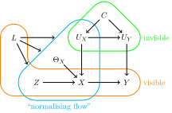

# Creating a using graphs in causalprog

In causalprog, directed acyclic graphs (DAGs) are used to represent causal problems.
This documentation page describes how these graphs can be created and used, and is aimed
at users of the library. Documentation for library developers can be found in [the documentation
for developers](../developers/graph.md).

## Creating a graph

A new (empty) graph can be created by directly calling the `Graph` class. There is one required
keyword argument: a label that is used to identify the graph. This label can be any string.

```python
from causalprog.graph import Graph

graph = Graph(label="I like graphs")
```

Nodes and edges can then be added to the graph using the method `add_node` and `add_edge`.
In this example, two data nodes that represent scalars are added with a directed edge pointing
from the first node to the second node.

```python
from causalprog.graph import DataNode

node1 = DataNode(label="first_node")
node2 = DataNode(label="second_node")

graph.add_node(node1)
graph.add_node(node2)
graph.add_edge(node1, node2)
```

The method `add_edge` can take either node labels or the nodes themselves as inputs, so the above
snippet could be rewritten more concisely as follows.

```python
from causalprog.graph import DataNode

graph.add_node(DataNode(label="first_node"))
graph.add_node(DataNode(label="second_node"))
graph.add_edge("first_node", "second_node")
```

If node objects are passed into `add_edge`, then `add_edge` will internally call `add_node` on
its inputs if they are not already nodes in the graph. Hence, the above snippets could be
written even more succinctly (but maybe less clearly) as follows.

```python
from causalprog.graph import DataNode

graph.add_edge(DataNode(label="first_node"), DataNode(label="second_node"))
```

When a node explicitly depends on other nodes, then edges will be automatically added to the
graph when the node is added. For example, in the following snippet a data node representing a
scalar and a continuous random variable node are added to the graph.

```python
from causalprog.graph import DataNode, ContinuousRandomVariableNode

graph.add_node(DataNode(label="first_node"))
graph.add_node(ContinuousRandomVariableNode(label="X", parents=["first_node"]))
```

As `"first_node"` is a parent of the random variable node, the edge pointing from `"first_node"`
to `"X"` will automatically be added the graph in the final line of this snippet.

## Nodes

This section of the documentation details the different types of graph node available in
causalprog.

### `ConstantNode`

A `ContantNode` is a node that represents a known constant value. These nodes have two required
keyword arguments that must be passed: a `label` for the node and the `value` that the node
represents:

```python
import jax.numpy as jnp
from causalprog.graph import ConstantNode

one = ConstantNode(label="one", value=1.0)
vector = ConstantNode(label="v", value=jnp.array([1.0, 1.0, 2.0]))
```

### `DataNode`

A `DataNode` is a node that represents a constant value that is not known when the node is created.
These nodes has one required keyword arguments that must be passed: a `label` for the node. They
can take the `shape` of the data that the node represents as an additional keyword argument, with
the default shape being `()` for a scalar value.

```python
import jax.numpy as jnp
from causalprog.graph import DataNode

scalar = DataNode(label="my_scalar")
vector = DataNode(label="my_vector", shape=(5, ))
matrix = DataNode(label="my_matrix", shape=(4, 2))
```

### Random variable nodes

Random variable node represent random variables (RVs) in a causal problem. There are two types of
random variable node in causalprog: `ContinuousRandomVariableNode` and `DiscreteRandomVariableNode`.
Both of these must be passed the a `label` for the node as a required keyword argument, and can
take a number of additional keyword arguments: the `shape` of the data that the RV outputs, a
function to `compute` the value of the RV from the values of its parents, and a list of `parents`
of the RV node. Discrete RV nodes must be passed an addition required keyword argument: a list of
possible `values` that the RV can output.

The `compute` function should take a single input, and will be passes a dictionary containing
the values of the parents of the node, with node labels as keys. It should return the value of the
RV.

```python
from causalprog.graph import ContinuousRandomVariableNode, DiscreteRandomVariableNode

node1 = DiscreteRandomVariableNode(values=[1.0, 1.5, 2.0], label="X")
node2 = ContinuousRandomVariableNode(label="Y")
node3 = ContinuousRandomVariableNode(
    label="2Y",
    compute=lambda values: values["Y"] * 2,
    parents=["Y"],
)
```

### `DistributionNode`

Distrubution nodes represent the values of random variables (RVs) that can be sampled from.
These nodes formed part of an earlier experimental version of the library and are not used in the
current demonstration applications.

## Ricardo's graph

Many of the examples in causalprog use an example graph for a problem proposed by Ricardo Silva:



causalprog provides a helper function to quickly generate this graph. This function must be passed
five required keyword arguments that tell the graph how to compute the nodes `"u_x"`, `"u_y"`,
`"phi_x"`, `"x"` and `"y"` from their parents.

```python
from causalprog.graph.ricardo import example_model

graph = example_model(
    compute_u_x=lambda values: values["c"][0] + 1.0,
    compute_u_y=lambda values: values["c"][1] * 2,
    compute_phi_x=lambda values: values["l"],
    compute_x=lambda values: values["z"] + values["phi_x"] - values["u_x"],
    compute_y=lambda values: values["x"] * values["u_y"],
)
```

## Using a graph

This section of the documentation demonstrated how graphs created using causalprog can be used.

### Nodes and edges

The nodes and edges of a graph can be obtained using the properties `graph.nodes` and `graph.edges`.
`graph.nodes` returns a tuple containing the nodes of the graph in a fixed but non-meaningful order.
`graph.edges` returns pairs of nodes indicating edges directed from the first node in the pair
towards the second node.

A single node in a graph can be obtained by passing the node's label into the function
`graph.get_node`, for example:

```python
x = graph.get_node("x")
```

### Root and leaf nodes

The root nodes of a graph are the nodes with no parents (these can be thought of as the starting
points of the graph, like the roots of a tree). The DAGs represented by causalprog are not
necessarily trees, so may contain more than one root node. The roots nodes of a graph can
be obtained using the property `graph.root_nodes`, which returns a tuple of nodes.

The leaf nodes of a graph are the nodes with no children (these can be thought of as the
ending points of the graph, liks the leaves of a tree). The leaf nodes of a graph can be
obtained using the property `graph.leaf_nodes`, which returns a tuple of nodes.

### Predecessors and successors

In a DAG, the predecessors of a node are the parents of that node, plus those parents' parents,
plus their parents, and so on. Similarly, the successors of the node are the node's children, plus
the children's children, and so on. In `causalprog` dictionaries mapping each node onto tuples of
this predecessors and successors can be obtained using the properties `graph.predecessors` and
`graph.successors`.

### Ordered nodes

The property `graph.ordered_nodes` and the method `graph.roots_down_to_outcome` can be used
to obtain tuples of nodes ordered so that every node's parents appear before that node in the
tuple. This ordering is useful when we want to iterate through the graph passing information from
parents to children as we go. `graph.ordered_nodes` will include all the nodes in the graph.
The method `graph.roots_down_to_outcome` is passed the label of a node and will return a list
that only includes that node and its predecessors.

### Sampling and evaluating nodes

The method `node.evaluate` can be used to compute values of particular nodes given the values
taken by their predecessors. Typical users will not interact with this method directly, but
will use the `evaluate` graph algorithm described below.

The method `node.sample` can be used to sample values from `DistributionNode`s. This method
formed part of an earlier experimental version of the library and is not used in the
current demonstration applications.

## Graph algorithms

The causalprog library includes a number of algorithms that can be applied to graphs that it has
created.

### `do`

The `do` algorithm applies a do intervention to a graph, returning a copy of the graph with
the intervention applied. Practically, this replaces the node that the do is applied to with a
`ConstantNode` and removes any predecessors of the node that no longer have any children in the
updated graph.

This algorithm takes three positional arguments: the graph, the label of the node the do is applied
to, and the value imposed on that node. It may also take a keyword argument: the label of the newly
created graph.

```python
from causalprog.algorithms import do

new_graph = do(graph, "x", 3.0)
```

### `evaluate` and `evaluate_down_to`

The `evaluate` and `evaluate_down_to` algorithms evaluate the values of nodes in the graph
given the values of some nodes as provided by the user. Each of these algorithms takes three
arguments: the graph, the label of a node, and the values of any given nodes. The `evaluate`
algorithm will return the evaluated value of the node whose label is passed in; the
`evaluate_down_to` algrithms returns that node's value plus the value of all of its predecessors,
stored as a dictionary with the node labels as keys.

```python
import jax.numpy as jnp
from causalprog.algorithms import evaluate

value = evaluate(graph, "x", {"l": jnp.array([2.0]), "z": jnp.array([1.0]), "c": 1.0})
```

### `replace_node`

The `replace_node` algorithm replaces a node in a graph with an alternative node, returning a copy
of the graph with the change made. This algorithm takes three arguments: the graph, the label of
the node to be replaced, and the new node. It may additionally take an extra keyword argmument:
the `label` of the copy of the graph.

```python
from causalprog.algorithms import replace_node
from causalprog.graph import ConstantNode

new_graph = replace_node(graph, "x", ConstantNode(label="new_x", value=3.0))
```

### `expectation` and `standard_deviation`

The `expectation` and `standard_deviation` algorithms can estimate the expectation and standard
deviation of a distribution node in a graph. The more general method `moment` can be used to
estimate any moment of a node - this method is used internally by the `expectation` and
`standard_deviation` algorithms.

These algorithms formed part of an earlier experimental version of the library and are not used in
the current demonstration applications.
