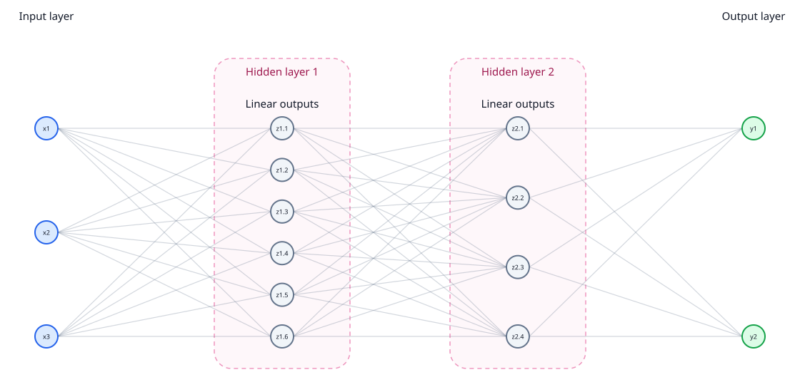
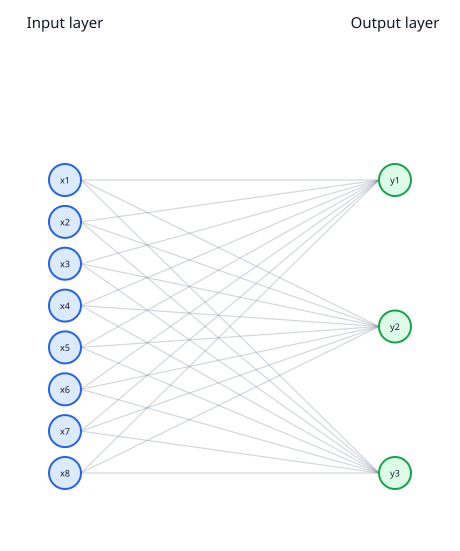
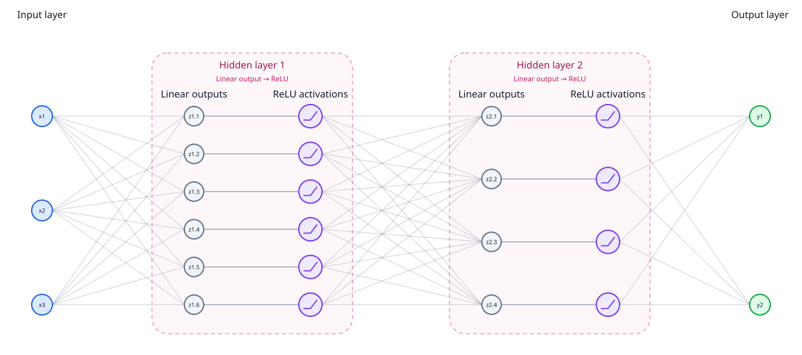
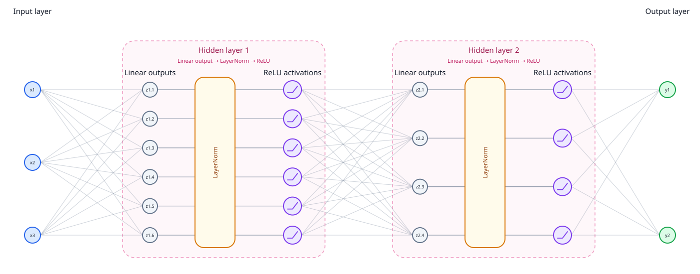
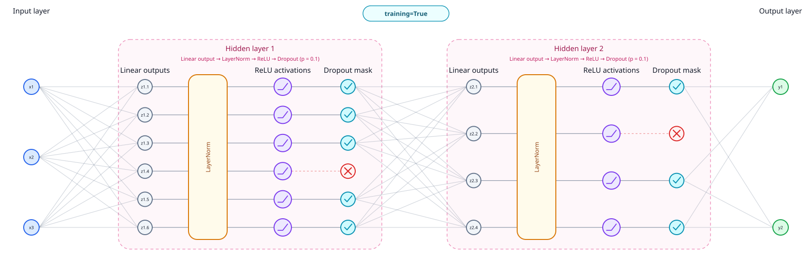

# Using MLPs

> **Summary:** `causalprog.mlps.mlp` builds a Flax NNX multilayer perceptron and
> returns two objects: a callable `FunctionalMLP` and its explicit parameter
> state `flax.nnx.State`. Use the callable for prediction and pass the parameter state separately
> so that it can be differentiated, optimised and checkpointed.

Developer details are in [MLP internals](../developers/mlps.md).

## Quick start

### Array inputs

The simplest way to construct an MLP is to specify its input width, output
width and the size of each hidden layer:

```python
import jax.numpy as jnp

from causalprog.mlps import mlp

network, parameters = mlp(
    input_dim=3,
    output_dim=1,
    hidden_dims=[16, 8],
    seed=0,
)

x = jnp.array([1.0, -0.5, 2.0])
prediction = network(x, parameters)
```

Here, `network` is the callable MLP and `parameters` contains its initial
weights and biases.

### PyTree inputs

An MLP can also accept a [PyTree](https://docs.jax.dev/en/latest/pytrees.html), such as a dictionary, as its input. Pass a
matching PyTree to `input_dim` to describe the shape of each input:

```python
import jax.numpy as jnp

from causalprog.mlps import mlp

input_format = {
    "x": 1,
    "z": jnp.array([2]),
    "l": jnp.array([3]),
}

network, parameters = mlp(
    input_dim=input_format,
    output_dim=1,
    hidden_dims=[16],
    seed=0,
)

values = {
    "x": 0.5,
    "z": jnp.array([1.0, -1.0]),
    "l": jnp.array([0.2, 0.4, 0.6]),
}

prediction = network(values, parameters)
```

The values must have the same PyTree structure as the input format.
`FunctionalMLP` flattens the values into a single array before passing them
through the network.

### Training and Dropout

Similarly to `PyTorch`, and `TensorFlow`, when training MLPs in `causalprog`, you will need to switch between training and eval mode when using non-determinism such as dropout.

By default, `FunctionalMLP`, represented here by `network`, is fully deterministic and in eval mode. We can activate training mode and dropout by passing `training=True` and `rngs` to `network`.

```python
import jax
from flax import nnx

network, parameters = mlp(
    input_dim=3,
    output_dim=1,
    hidden_dims=[16, 8],
    dropout_rate=0.1,
)

prediction = network(
    x,
    parameters,
    training=True,
    rngs=nnx.Rngs(dropout=jax.random.key(0)),
)
```

A full training example can be seen in: !!Add example link here!!

## Defining MLPs in `causalprog`

In frameworks such as [PyTorch](https://docs.pytorch.org/docs/stable/index.html)
and [TensorFlow](https://www.tensorflow.org/), a model object commonly stores
both the network architecture and its current parameter values. `causalprog`
keeps these separate. This follows JAX's functional style, in which array state
is passed explicitly to functions, and matches the way functions on
`causalprog` graph nodes receive their parameters separately from their input
values.

Keeping the parameters explicit makes it straightforward to pass them through
JAX transformations, differentiate them, update them with an optimiser,
checkpoint them, or evaluate the same network architecture with a different
parameter state.

MLPs are normally constructed with the [`causalprog.mlps.mlp`][causalprog.mlps.mlp.mlp] builder:

```python
network, parameters = mlp(...)
```

This returns two objects:

- `network` is a [`causalprog.mlps.FunctionalMLP`][causalprog.mlps.mlp.FunctionalMLP]. It stores the network
  architecture and expected input format, and defines how an input is evaluated.
- `parameters` is a [`flax.nnx.State`](https://flax.readthedocs.io/en/stable/api_reference/flax.nnx/state.html) 
  containing the initial trainable parameter values, such
  as the weights and biases of the linear layers.

Both are passed to the network when it is evaluated:

```python
prediction = network(input_values, parameters)
```

Users will normally create a [`FunctionalMLP`][causalprog.mlps.mlp.FunctionalMLP] through [`mlp`][causalprog.mlps.mlp.mlp] rather than
instantiating one directly. See the [API reference](../api.md) for the complete
signatures and available options.

### Defining layer dimensions

The dimensions of an MLP are primarily determined by:

- `input_dim: int` — the number of input features.
- `output_dim: int` — the number of output values.
- `hidden_dims: Sequence[int]` — the number of units in each hidden layer.

For example,

```python
network, parameters = mlp(
    input_dim=3,
    output_dim=2,
    hidden_dims=[6, 4],
    norm=None,
    activation=None,
)
```

produces



For causal graphs, you may even want an mlp with no hidden layers, just a single linear transformation, e.g.

```python
network, parameters = mlp(
    input_dim=8,
    output_dim=3,
    hidden_dims=[],
    norm=None,
    activation=None,
)
```



### Adding activations

Without activation functions, and with normalisation disabled, several linear
layers are equivalent to a single linear transformation. Activation functions
introduce the non-linearity that allows an MLP to learn more complex
relationships.

For example, we can add [ReLU](https://en.wikipedia.org/wiki/Rectified_linear_unit)
to the previous MLP:

```python
network, parameters = mlp(
    input_dim=3,
    output_dim=2,
    hidden_dims=[6, 4],
    norm=None,
    activation="relu",
)
```



The activation is applied after every hidden linear layer. The output layer
remains linear.

The following activation functions are available:

| `activation` | Description |
| ------------ | ----------- |
| [`"gelu"`](https://en.wikipedia.org/wiki/Activation_function#Table_of_activation_functions) | A smooth activation and the default used by `mlp`. |
| [`"relu"`](https://en.wikipedia.org/wiki/Rectified_linear_unit) | Sets negative values to zero. A common and computationally simple choice. |
| [`"silu"`](https://en.wikipedia.org/wiki/Swish_function) | A smooth activation that gradually suppresses negative values. |
| [`"tanh"`](https://en.wikipedia.org/wiki/Hyperbolic_functions#Hyperbolic_tangent) | Maps values to the interval \([-1, 1]\). |
| [`"identity"`](https://en.wikipedia.org/wiki/Identity_function) or `None` | Applies no activation function. |

### Adding normalisation

Normalisation rescales the intermediate values produced by the hidden layers.
This can make optimisation more stable, particularly in deeper networks,
although it may be unnecessary for small MLPs.

For example, we can add LayerNorm to the hidden layers:

```python
network, parameters = mlp(
    input_dim=3,
    output_dim=2,
    hidden_dims=[6, 4],
    norm="layernorm",
    activation="relu",
)
```



Normalisation is applied after every hidden linear layer and before the
activation function. The output layer is not normalised.

The following normalisation options are available:

| `norm` | Description |
| ------ | ----------- |
| [`"layernorm"`](https://en.wikipedia.org/wiki/Normalization_(machine_learning)#Layer_normalization) | Centres and scales values using their mean and variance. |
| [`"rmsnorm"`](https://en.wikipedia.org/wiki/Normalization_(machine_learning)#Root_mean_square_layer_normalization) | Scales values using their root mean square without centring them. |
| `None` | Applies no normalisation. This is the default. |

### Adding dropout

!!! important

    A non-zero `dropout_rate` configures dropout, but dropout is applied only
    when `network(..., training=True)`. The default is `network(..., training=False)`.

[Dropout](https://en.wikipedia.org/wiki/Dropout_\(neural_networks\)) is a
regularisation technique that randomly sets some hidden activations to zero
during training. This can reduce overfitting by preventing the network from
relying too heavily on particular hidden units.

The `dropout_rate` argument sets the probability that each hidden activation
will be dropped. For example, we can configure the previous MLP with a dropout
rate of 10%:

```python
network, parameters = mlp(
    input_dim=3,
    output_dim=2,
    hidden_dims=[6, 4],
    norm="layernorm",
    activation="relu",
    dropout_rate=0.1,
)
```



Dropout is applied after the normalisation and activation function in every
hidden layer. It is not applied to the output layer.

`dropout_rate` must be in the interval \([0, 1)\). Its default value is `0.0`,
which disables dropout.

Setting a non-zero `dropout_rate` adds dropout to the network architecture, but
does not activate it by itself. Dropout is only used when the network is
evaluated with `training=True`. Since `training=False` by default, the network
remains deterministic unless training mode is explicitly enabled.

## Using MLPs

Once an MLP has been constructed, evaluate it by passing the input values and
parameter state to `network`. The same interface is used for inference,
training and functions attached to a causal graph.

### Inference

Inference is deterministic by default because `network(..., training=False)`
is the default. This remains true if the MLP is constructed with a non-zero
`dropout_rate`.

#### Array inputs

For an array input, the size of its final dimension must equal the configured
`input_dim`:

```python
import jax
import jax.numpy as jnp

from causalprog.mlps import mlp

array_network, array_parameters = mlp(
    input_dim=3,
    output_dim=1,
    hidden_dims=[16, 8],
    seed=0,
)

input_values = jnp.array([1.0, -0.5, 2.0])
prediction = array_network(input_values, array_parameters)
```

#### PyTree inputs

For a PyTree input, pass a PyTree with the same structure and leaf shapes
as the `input_dim` used to construct the MLP:

```python
input_format = {
    "x": 1,
    "z": jnp.array([2]),
    "l": jnp.array([3]),
}

pytree_network, pytree_parameters = mlp(
    input_dim=input_format,
    output_dim=1,
    hidden_dims=[16],
    seed=0,
)

input_values = {
    "x": 0.5,
    "z": jnp.array([1.0, -1.0]),
    "l": jnp.array([0.2, 0.4, 0.6]),
}

prediction = pytree_network(input_values, pytree_parameters)
```

`FunctionalMLP` flattens the leaves into one array before applying the first
linear layer.

Use a JAX array of dimensions to describe a multidimensional leaf, for example
`{"matrix": jnp.array([2, 3])}`. Do not use `{"matrix": (2, 3)}` for this
purpose because JAX treats a tuple as another PyTree container.

#### Batched inputs

Array inputs support leading batch dimensions directly. Each row in this
example is one three-feature observation:

```python
array_batch = jnp.array(
    [
        [1.0, -0.5, 2.0],
        [0.0, 1.5, -1.0],
        [2.0, 0.5, 0.25],
    ]
)

array_predictions = array_network(array_batch, array_parameters)
```

Here, `array_predictions` has shape `(3, 1)`.

For PyTree inputs, one call to `network` represents one observation. Use
`jax.vmap` to evaluate a batch while preserving that structure:

```python
pytree_batch = {
    "x": jnp.array([0.5, -0.25, 1.0]),
    "z": jnp.array(
        [
            [1.0, -1.0],
            [0.0, 0.5],
            [2.0, 1.0],
        ]
    ),
    "l": jnp.array(
        [
            [0.2, 0.4, 0.6],
            [0.1, 0.3, 0.5],
            [0.0, 0.5, 1.0],
        ]
    ),
}


def predict_one(observation):
    return pytree_network(observation, pytree_parameters)


pytree_predictions = jax.vmap(predict_one)(pytree_batch)
```

`pytree_predictions` also has shape `(3, 1)`.

### Training

`causalprog` does not provide an MLP-specific fitting method. Because the
parameters are stored explicitly, they can be differentiated with JAX and
updated with an optimiser such as Optax.

The following example trains an MLP on a simple regression problem. It also
uses dropout, so a fresh dropout key is supplied to every training step:

```python
import jax
import jax.numpy as jnp
import optax
from flax import nnx

from causalprog.mlps import mlp

x_train = jnp.linspace(-1.0, 1.0, 128).reshape(-1, 1)
targets = x_train**3 + 0.3 * x_train - 0.2

network, parameters = mlp(
    input_dim=1,
    output_dim=1,
    hidden_dims=[16, 16],
    activation="relu",
    norm="layernorm",
    dropout_rate=0.1,
    seed=0,
)

optimiser = optax.adam(1e-2)
optimiser_state = optimiser.init(parameters)


def loss_fn(current_parameters, dropout_key, x, target):
    predictions = network(
        x,
        current_parameters,
        training=True,
        rngs=nnx.Rngs(dropout=dropout_key),
    )
    return jnp.mean((predictions - target) ** 2)


@jax.jit
def train_step(parameters, optimiser_state, dropout_key, x, target):
    loss, gradients = jax.value_and_grad(loss_fn)(
        parameters,
        dropout_key,
        x,
        target,
    )
    updates, optimiser_state = optimiser.update(
        gradients,
        optimiser_state,
        parameters,
    )
    parameters = optax.apply_updates(parameters, updates)
    return parameters, optimiser_state, loss


dropout_key = jax.random.key(0)

for _ in range(1_000):
    dropout_key, step_key = jax.random.split(dropout_key)
    parameters, optimiser_state, loss = train_step(
        parameters,
        optimiser_state,
        step_key,
        x_train,
        targets,
    )

predictions = network(x_train, parameters)
```

`jax.value_and_grad` differentiates the loss with respect to the parameter
state, and `optax.apply_updates` returns its updated value. The final call uses
the default `training=False`, so dropout is disabled for inference.

If the MLP does not use dropout, the dropout key and `rngs` argument can be
omitted.

### Using MLPs in Ricardo's graph

The [continuous-treatment model](../theory/continuous-treatments.md) accepts
callables that compute the values of its random-variable nodes. An MLP can
provide each callable while its parameter state remains in a separate model
parameter dictionary.

The wrapper below performs two small but important tasks:

- It selects the values required by one node from the accumulated graph values.
- It selects that node's parameter state from the shared parameter dictionary.

```python
import jax.numpy as jnp

from causalprog.algorithms import evaluate
from causalprog.graph.continuous_treatment import continuous_treatment_model
from causalprog.mlps import mlp


def make_scalar_node_mlp(parameter_name, input_format, *, seed):
    input_keys = tuple(input_format)
    network, initial_parameters = mlp(
        input_dim=input_format,
        output_dim=1,
        hidden_dims=[8],
        seed=seed,
    )

    def compute(values, model_parameters):
        node_inputs = {key: values[key] for key in input_keys}
        return network(node_inputs, model_parameters[parameter_name])[0]

    return compute, initial_parameters


compute_u_x, theta_u_x = make_scalar_node_mlp(
    "theta_u_x",
    {"c": 1, "l": jnp.array([1])},
    seed=0,
)
compute_u_y, theta_u_y = make_scalar_node_mlp(
    "theta_u_y",
    {"c": 1, "u_x": 1, "l": jnp.array([1])},
    seed=1,
)
compute_x, theta_x = make_scalar_node_mlp(
    "theta_x",
    {"l": jnp.array([1]), "z": jnp.array([1]), "u_x": 1},
    seed=2,
)
compute_y, theta_y = make_scalar_node_mlp(
    "theta_y",
    {"x": 1, "u_y": 1, "l": jnp.array([1])},
    seed=3,
)

graph = continuous_treatment_model(
    k=3,
    l_len=1,
    z_len=1,
    compute_u_x=compute_u_x,
    compute_u_y=compute_u_y,
    compute_x=compute_x,
    compute_y=compute_y,
)

model_parameters = {
    "theta_u_x": theta_u_x,
    "theta_u_y": theta_u_y,
    "theta_x": theta_x,
    "theta_y": theta_y,
}

y = evaluate(
    graph,
    "y",
    {
        "c": 1.0,
        "l": jnp.array([0.2]),
        "z": jnp.array([0.5]),
    },
    model_parameters,
)
```

The returned value uses the MLPs' initial parameters and is therefore not a
meaningful fitted prediction. The example demonstrates how MLPs and their
external parameter states are attached to and evaluated through the graph.
For training or causal optimisation, `model_parameters` can be passed through
an objective and differentiated as one PyTree.
